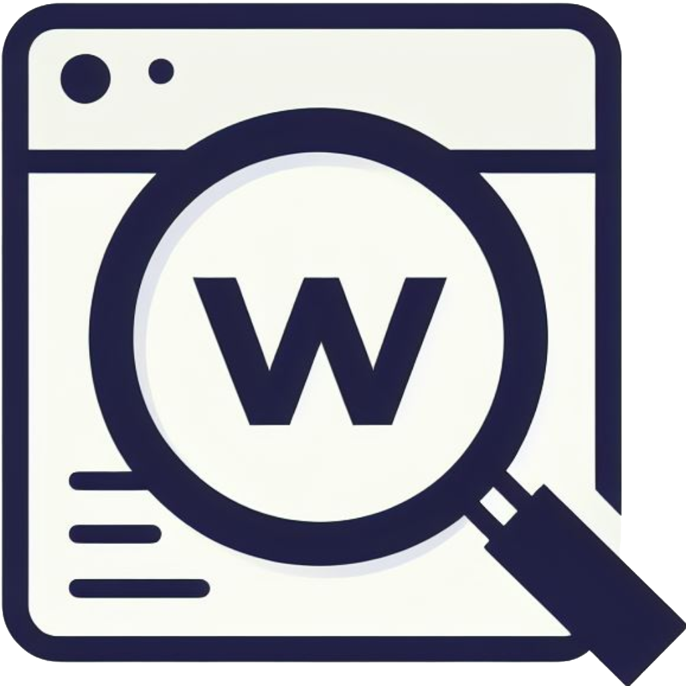

## Text Inspector

**Text Inspector** é uma ferramenta online que permite contar caracteres e palavras em um texto, além de extrair texto de arquivos PDF para contar o número de caracteres.

  

### Recursos

- **Contagem de caracteres e palavras:** A ferramenta conta o número de caracteres e palavras em um texto inserido em uma caixa de texto.
- **Opção de contar espaços:** Permite incluir ou excluir espaços na contagem de caracteres.
- **Extração de texto de PDF:** A ferramenta permite carregar arquivos PDF e extrair o texto deles, incluindo suporte para arquivos protegidos por senha.
- **Seleção de página:** Permite selecionar a página específica do arquivo PDF para extrair o texto.
- **Interface amigável:** A ferramenta possui uma interface simples e intuitiva, fácil de usar.

### Como usar

1. **Insira o texto:** Cole o texto que deseja analisar na caixa de texto.
2. **Selecione as opções:** Marque a caixa de seleção "Contar espaços" se desejar incluir espaços na contagem de caracteres.
3. **Carregue o arquivo PDF (opcional):** Clique no botão "Enviar" para carregar um arquivo PDF e extrair o texto.
4. **Selecione a página (opcional):** Selecione a página do arquivo PDF que deseja extrair o texto.
5. **Visualize os resultados:** Os resultados da contagem de caracteres e palavras serão exibidos na tela.

### Arquivos

- **`index.html`**: Arquivo HTML principal que contém a estrutura da ferramenta.
- **`styles.css`**: Arquivo CSS que define o estilo da ferramenta.
- **`main.js`**: Arquivo JavaScript que implementa a funcionalidade da ferramenta.
- **`assets/logo.png`**: Ícone da ferramenta.

### Instalação

Nenhuma instalação é necessária. Basta abrir o arquivo `index.html` em seu navegador.

### Contribuições

Contribuições são bem-vindas! Se você encontrar algum problema ou tiver sugestões de melhorias, sinta-se à vontade para abrir um problema ou enviar um pedido de pull.

### Licença

Este projeto é licenciado sob a licença MIT.
